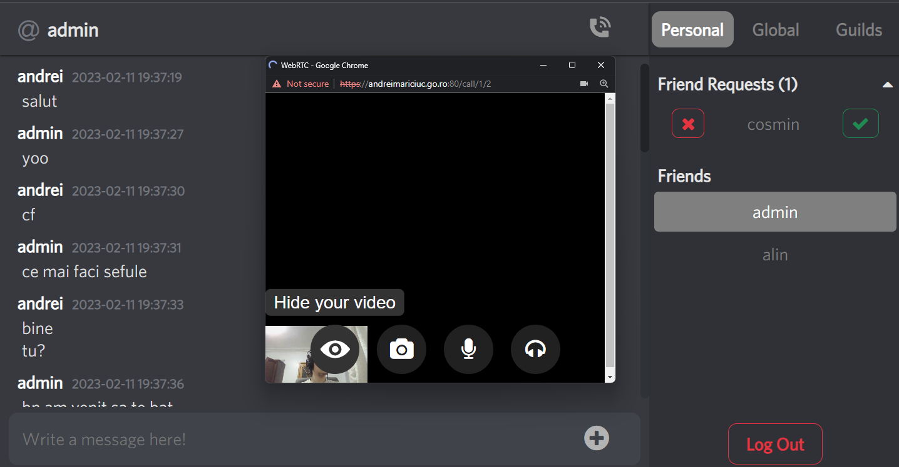

# let be Harmony as H - a chat app, such that H != Discord :) 

This is a real-time chat application built using Node.js, Socket.io, Vue.js, WebRTC and Spring Boot.
The app allows users to send and receive messages, files and videos in real-time and also to 
start a video call.

### Features
* Users can create accounts and log in to access the chat app
* Users can search for new friends and start chatting
* A variety of file types('png', 'jpeg', 'gif', 'jpg', 'mp4', 'mp3' etc.) can be sent using chat next to text
* Real-time messaging using Socket.io
* Real-time video call using WebRTC

